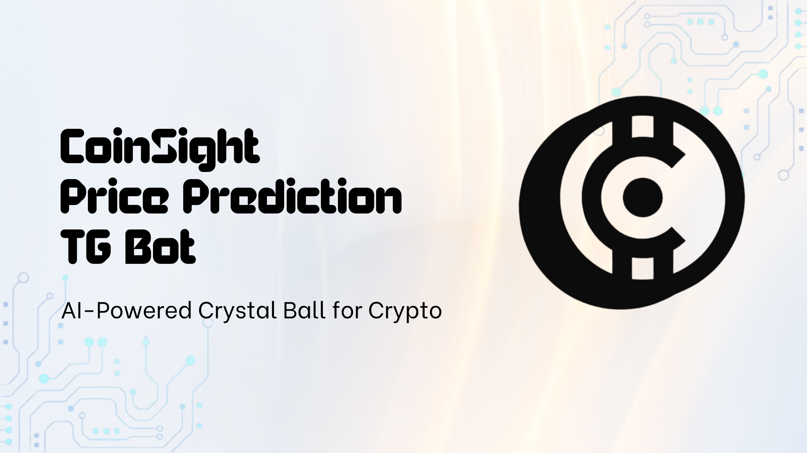

# CoinSight: Cryptocurrency Price Prediction Bot - ETHSafari 2024 Hackathon

## Table of Contents

1. [Project Overview](#project-overview)
2. [Inspiration](#inspiration)
3. [Why Telegram?](#why-telegram)
4. [Features](#features)
5. [How It Works](#how-it-works)
6. [Demo](#demo)
7. [Live Deployment](#live-deployment)
8. [Tech Stack](#tech-stack)
9. [Challenges Faced](#challenges-faced)
10. [Roadmap](#roadmap)
11. [Team Members](#team-members)

## Project Overview

CoinSight is a Telegram bot designed to provide users with a reliable and efficient tool for accessing historical price data and future price predictions. This enables them to make more informed decisions about their investments for maximum returns.

## Inspiration

The main inspiration behind CoinSight was the need for a reliable and efficient tool that users who own assets in the blockchain can use to:

1. Access historical price data
2. Obtain future price predictions
3. HODL or sell their assets or buy new ones based on the predictions

By combining blockchain data indexing with AI-powered predictions, CoinSight aims to empower users to maximize their returns on investments in the blockchain.

## Why Telegram?

It is much easier to onboard the users of an existing platform than to grow a new one from scratch. Telegram is a popular messaging platform in the blockchain community - that's why it's the communication channel of choice for ETHSafari 2024. By integrating CoinSight with Telegram, we can leverage the platform's existing user base to quickly onboard users in a familiar environment.

## Features

- **Historical Data Analysis**: Utilizes a custom subgraph to fetch historical price data for cryptocurrencies.
- **ORA AI Oracle**: Uses the ORA AI Oracle Plugin by Chainsafe to get AI-powered predictions for cryptocurrencies.
- **Telegram Integration**: Provides a Telegram bot interface for users to interact with the predictions.

## How It Works

### Subgraph Component

The subgraph continuously indexes price data from Chainlink price feeds on the Ethereum mainnet. This allows for efficient querying of historical price data for supported cryptocurrencies.

### Telegram Bot Component

The bot serves as the user interface, allowing users to:

1. Select a cryptocurrency.
2. Choose a future date for prediction
3. View recent historical price data
4. Receive an AI-generated price prediction for the selected date

### AI Prediction Process

1. The bot fetches recent historical price data from the subgraph.
2. This data is used to formulate a prompt for ORA AI on-chain model using Web3 JS plugin.
3. The AI model processes the historical data and generates a price prediction.
4. The prediction is returned to the user via the Telegram bot.

By combining these components, CoinSight provides users with a seamless experience for accessing both historical and predicted future price data for their chosen assets.

## Demo

[CoinSight Demo](https://share.vidyard.com/watch/YesqZj1MFQmF2CJcNM86jx?)

## Live Deployment

[CoinSight Bot](https://t.me/coinsightv1bot)

## Tech Stack  

- NodeJS
- The Graph
- Web3 JS
- ORA AI Oracle Plugin by Chainsafe
- Telegram Bot API
- Chainlink Price Feeds
- Docker
- AWS for deployment

## Challenges Faced

1. **Data Availability**: Finding the right smart contracts to query for historical price data proved challenging. Many contracts initially considered for the subgraph did not have sufficient historical data to make informed predictions.

2. **Documentation Gaps**: The team faced difficulties due to insufficient documentation for some of the tools used in the project. This required additional research and experimentation to implement certain features correctly.

## Roadmap

1. **Roll Out to Additional Platforms**: Integrate CoinSight with other messaging platforms like Discord to reach a wider audience.

2. **Improve Prediction Accuracy**: We hope to achieve this by training a custom ML model specialized for time series data as opposed to using LLMs provided the ORA AI Oracle Plugin.

3. **Add More Tokens**: Integrate more token contracts to the subgraph to provide a wider range of assets for users to query.

4. **Issue Realtime Data Updates**: Implement a notification system to alert users when new price data is available for their selected assets.

## Team Members

- [Moses Odhiambo](https://github.com/badass-techie)
- [Dennis Kimathi](https://github.com/dennohkim)
